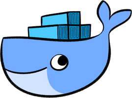
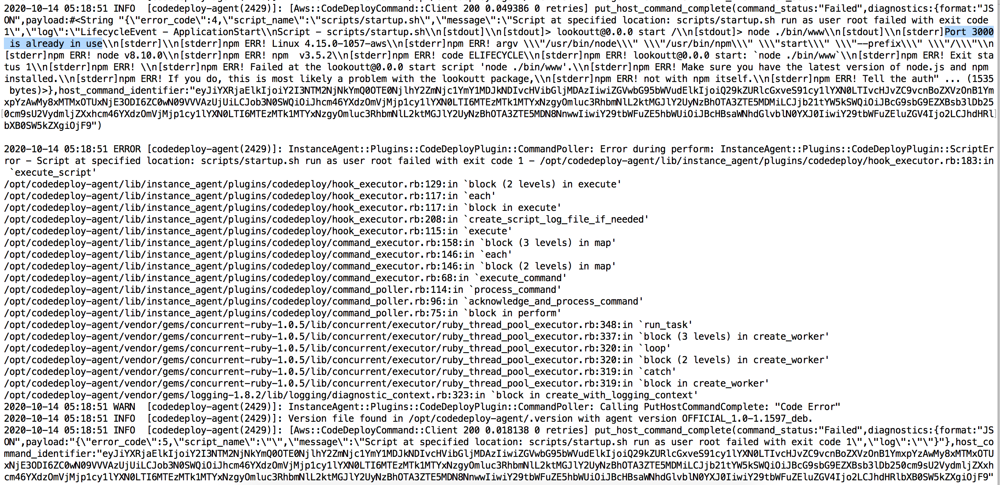

*or maybe just non-AWS deployment...*

As a student in college, I never really understood the value of containers and [Docker](https://www.docker.com/), technology that seemed to pervade every single company that I interned at. It's like when everyone tells you: don't eat that, it taste like crap. You take their word for it, but you never really understand until you try it and realize - oh it DOES take like crap.


*Well known fact, 50% of users use Docker because of the cute logo*

This is the story of how I tasted the crap. A few months back, I was tinkering around with a side project that I wanted to deploy onto AWS EC2. Up until now, a lot of my [side projects]() had been spun up on my own hardware that I could control. However, now that my Raspberry Pi and extra computers were tied up running other programs, I turned to [Amazon AWS](https://aws.amazon.com/) to take advantage of its free tier membership that let me use its [EC2](https://aws.amazon.com/ec2/) instances (basically just a computer in some Amazon data center somewhere).

I had completed developing my little website locally, and was interested in figuring out a deploy process to get the server running on an EC2 instance. Snooping around, I discovered [AWS CodeDeploy](https://aws.amazon.com/codedeploy/), thought to myself "Great! I could get familiar setting up and interacting with my own code deployment pipeline!", and dove into the documentation ready to setup my website.

## Setup struggles

I was instantly greeted with a maze of AWS concepts and terminology to slog through. Here's the steps I had to walk through to get the first deploy working (I may be missing a step this was a bit ago...):

1. Set up an IAM instance profile to let the EC2 instance make API calls
2. Create and spin up an EC2 instance that's compatible with CodeDeploy
3. Tag the EC2 instance with a special tag so CodeDeploy would recognize it as an instance to deploy to
4. Ssh into my EC2 instance to manually install CodeDeploy onto the instance
5. Create an "application" for CodeDeploy
6. Create a "deployment group" for the "application" in CodeDeploy
7. Create an S3 bucket that holds the "revision" that is deployed to the EC2 instance
8. Create an app spec that holds commands to run at different steps of the deploy process
9. Create a "revision" and push that revision to the S3 bucket
10. Finally create a deployment using the revision in the S3 bucket and deploy to the EC2 instance

The list above is a *shortened* version. Each of those steps required understanding AWS specific concepts and digging into documentation mazes. For example, the app spec allowed me to define various commands that would run during "hooks", which were different stages of the deployment. I had to define the hooks, BeforeInstall, which allowed you to run a script before your app was installed, ApplicationStart, which allowed you to run a script to start your application, and ApplicationStop, which allowed you to run a script to stop your application.

The first deployment I made rolled out without a hitch. I checked the EC2's public url and was able to visit and interact with my website. I noticed some formatting errors that broke my website on mobile, and made some tweaks to fix it. I went to deploy this change, which involved:

1. Pushing a new "revision" to the S3 bucket
2. Create a deployment using the revision in the S3 bucket and deploy to the EC2 instance

When deployed the change though, the deployment ended up failing. Puzzled, I checked the deployment logs, and noticed that my command for ApplicationStart had failed. What? I never touched that, what changed?


*Key part: "Port 3000 is already in use"*

## Frustration begets understanding

I realized that everytime I deployed code, the deployment would happen on the same instance the previous deployment had ran on. This meant that the state of the instance was different per deployment; previous deployments would affect future deployments. In this case, because the EC2 instance was already running a web server from the first deployment that was using port 3000, the second deployment wasn't able to successfully use port 3000 when attempting to bring up another web server. This meant that I would either have to 1) tear down the instance, and go through the entire process of bringing up another instance, and then deploy again, or 2) in the ApplicationStop step where the application was shutting down, I would have to add a line shutting down the web server. Of course, I went with option 2), and proceeded with my development. However, the experience quickly became more and more frustrating. I would constantly have to check for the existence of files that I created during the deployment and delete them during the ApplicationStop step in order to return the instance to a "clean" state for future deployments. On top of that, debugging deployments was incredibly painful - the process of pushing to S3 took at least a minute and creating the deployment from the S3 revision took another minute. Both CLI commands were extremely long and error prone.

```
$ aws deploy push --application-name Lookoutt_App --description "this is a revision" 
--ignore-hidden-files --s3-location s3://codedeploylookouttbucket/LookouttApp.zip --source .

$ create-deployment --application-name Lookoutt_App --s3-location bucket=codedeploylookouttbucket,
key=LookouttApp.zip,bundleType=zip,eTag=15196939335d95b9f633499068d26384-5 --deployment-group-name Lookoutt_DepGroup
 --deployment-config-name CodeDeployDefault.OneAtATime
```

If a deployment failed, I would have to manually SSH into the EC2 instance and hunt down the deploy logs to try to figure out what had happened. Why couldn't every deployment attempt just automatically be over a fresh newly booted up EC2 instance like - oh 💡. It finally clicked. THAT'S why stateless deployment was so popular!

## A new beginning

The next side project I worked on ([Secondhand First](https://secondhandfirst.shop)), I had enough. I wasn't going to go through that painful process again. By this time, I had some experience working with Docker at work, and if I knew one thing, it was the fact that Docker and containers were supposed to be a solution to stateful deploys. I decided to take that route this time.

*WOW!* It was a such a better experience. The process for getting my application onto the AWS EC2 instance was as follows:

1. Install Docker on my computer
2. Create a Dockerfile. Specify in the Dockerfile an official Docker node.js image to build off of and add installation and application start commands in the Dockerfile (no need for clean up commands!)
3. Use `docker compose` to create a build with the Dockerfile
4. Run build locally to see if it works
5. If build works like you want it, push it to your Docker registry
6. Create an EC2 instance (that's it, no other AWS specific stuff)
7. Ssh into the EC2 instance, install Docker, sign into your Docker account and download the latest build
8. Use `docker run` to run the image in the instance, and you're done!

After the initial setup, the deploy process became much simpler, especially once I linked my github account to Docker so new builds were automatically created when new code was pushed to my master branch. The deploy process became:

1. Push new code to master
2. Ssh into EC2 instance
3. Use `docker run` to download and run the latest image

While the number of steps may be comparable to AWS CodeDeploy, there is so much less frustration here. For one, as long as your docker image works locally, you can have almost 100% confidence that it'll work the same way in the EC2 instance. On top of that, because there's no underlying state, there's no constant debugging during the deployment process to figure out what has already been installed and which hooks need to be changed in order for the deploy to work. Rather than the sensation of dread I used to feel when deploying with CodeDeploy, I actually started looking forward my Docker centered deploy process.

I'm sure there's a time and place for everything, and I'm well aware stateless deployment isn't the solution for every application. For now though, I'll be sure to remember my pain and stick with stateless deployments whenever I can. ✌️
