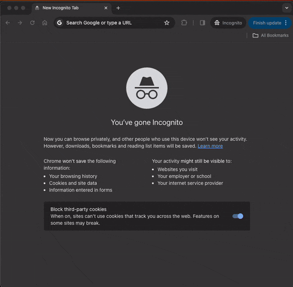

I've been busy embedding myself in the intersection of biotech and climate tech for the past few months by reading, writing, and talking with as many people as I can. I've been itching to get back to my coding roots though, and so decided to hack together a quick project over the course of a few days. I wanted to work on something that would allow me to brush up on my front end development skills while also being biology related. Thus, I developed a simple protein visualization app. The app:

- Lets you type in some keywords
- Queries [Protein Data Bank](https://www.rcsb.org/)'s API for entries that match the keywords
- Lets you choose a specific entry
- Renders the molecule via [molstar](https://github.com/molstar/molstar/tree/master)

The demo website can be found [here](https://protein-visualization-web-app.vercel.app/), and the source code can be found [here](https://github.com/goccert25/protein_visualization_web_app).

In case Protein Data Bank ever changes their API and the website no longer works, here's a gif to prove it once worked:

## Quick Personal Takeaways

- The React philosophy of state driven UI's is as clean as I remembered and makes React easy to pick back up even after a few years
- Molstar is definitely a bit clunky to use
- Vercel makes deploying hobby projects made with Next.js ridiculously easy
