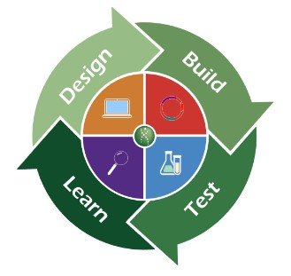
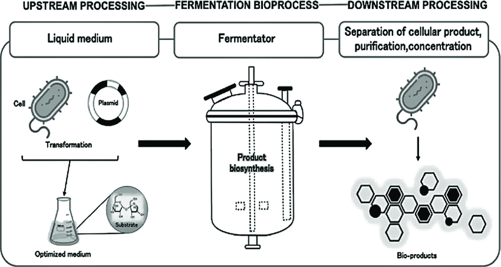
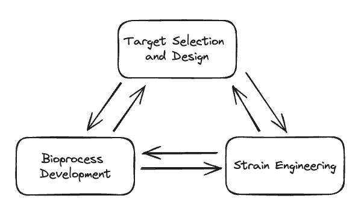

As mentioned in my [last blog post](), I've been exploring the synthetic biology space from the perspective of "how do I make technology that can act as a lever to move this ecosystem forward?". My hunch is that [a space projected to go from 13.09 billion in 2022 to 55.37 billion dollars by 2030](https://www.grandviewresearch.com/industry-analysis/synthetic-biology-market) will surely need picks and shovels companies to support that kind of growth.

In this blog post I break down what I understand to be the "traditional" business path a synthetic biology company takes from inception to maturity, the various problems along the way, and existing players that help solve those problems. I use a fictitious company called Mika (named after my dog) that is making bio based fabrics that can replace traditional oil based polyester. Hopefully this article gives a solid high level overview of the ecosystem for the next entrepreneur stepping into the space.

## Target selection and design

To start, Mika needs to identify a promising protein that functionally performs better than polyester. In this fictitious scenario, Mika settles on spider silk. However, spider silk also has several (fictitious) downsides: spider silk doesn't retain color well, can become slimy at high temperatures, and gives off a bad odor.

Mika uses spider silk as a starting point and begins iterating on the molecular structure to remove these undesirable traits. Historically, scientists work off of intuition built up from past experiences and existing research papers on techniques or modifications that might work. Scientists make a series of educated guesses on modifications, concoct various candidates, create those molecular structures, and test whether the new molecules actually work. This cycle is commonly known as the Design-Build-Test-Learn (DBTL) cycle, and is extremely expensive and time consuming, easily composing a large chunk of the R&D budget. However, with the latest advances in ML for protein design, R&D timelines are going from years to months, as ML models are able to suggest candidates that have a higher likelihood of success.

*[Source](https://synbio-tech.com/synthetic-biology/)*

Existing companies that help with target selection and design typically do so by increasing the speed of a single DBTL iteration (automation) or reducing the number of DBTL cycles necessary (ML for protein design). Companies like [Automata](https://automata.tech/) and [Opentrons](https://opentrons.com/) help with the former, and companies like [Arzeda](https://arzeda.com/), [Cradle](https://cradle.bio/), and [Profluent](https://www.profluent.bio/) help with the latter.

Mika is focusing on a protein, but the range of products that can be produced from synthetic biology is huge. For example, [Zero Acre Farms](https://www.zeroacre.com/) and [Melt and Marble](https://www.meltandmarble.com/) are targeting lipids while [Capra Biosciences](https://www.caprabiosciences.com/) is targeting vitamins.

## Strain engineering

After arriving at a modified spider silk that fulfills all target requirements, Mika now needs to figure out how to actually produce the silk. While there are some companies pursuing cell-free manufacturing (most notably [Solugen](https://solugen.com/)), it is more common to see companies using precision fermentation. In precision fermentation, the instructions to develop your protein of interest are inserted into a specific microbe, also known as a chassis. The microbe is then fed a steady diet of food, allowing it to duplicate while continually producing more of your protein.

In strain engineering you choose your chassis and then repeatedly modify it to improve its ability to produce your desired protein. Various types of modifications could include:

- Increasing resilience to foreign bodies: maintaining a perfectly sterile environment is difficult and increased resilience can reduce the risk of a spoiled end product
- Making the chassis more robust to environmental variation: variables such as pH, temperature, dissolved oxygen content, and amino acid availability can fluctuate inside of a production environment
- Removing existing metabolic cycles to optimize for target protein production: your chosen chassis could spend 50% of its resources producing your protein and the other 50% of its resources performing other metabolic functions. If other metabolic functions aren't needed in your controlled production environment, you can genetically modify your chassis to remove them, allowing your chassis to spend more of its resources on producing your protein.

[HERLab](https://www.herlab.bio/) and [Wild Microbes](https://www.wildmicrobes.com/) are two startups that specialize in helping you choose the best chassis for your needs. [Culture Biosciences](https://www.culturebiosciences.com/) is a cloud based R&D platform that can improve the quality and speed of your DBTL cycles, ideally helping you reach your optimal chassis faster.

## Bioprocess development

Now that Mika has finished developing the protein and creating the microbe to produce the protein, they have to develop the full bioprocess. At a high level, the bioprocess can be broken down into upstream processing, fermentation, and downstream processing.

*[Source](https://www.researchgate.net/figure/Simplified-flow-of-bioprocess-steps-upstream-processing-fermentation-process-and_fig2_336857029)*

During fermentation, the microbe that you genetically engineered to produce your target protein and the food to feed your microbe are placed inside of a special container known as a bioreactor. Upstream processing is everything prior to this step, and downstream processing is everything after this step.

Developing your upstream process could involve:

- Media optimization: figuring out what composition of "food" is best suited for the microbes. E.g. how much glucose, amino acids, oxygen, etc to feed the microbe
- Media sterilization: developing a process to sterilize the media so that minimal foreign microbes enter the bioreactor
- Seed train: cells often go through various different stages during their life cycles. Likely only a subset of the stages are optimal for target protein production. Typically the genetically modified chassis is moved between various environments and containers to guide the cells through the different stages until the stage of optimal production, during which it is moved to the final production sized bioreactor. This whole process is known as a seed train

Several factors also go into the fermentation process:

- Bioreactor design: there are various types of bioreactors, such as air lifted, stir tanked, and more. All designs have their trade-offs and analysis needs to be done to decide which one is best suited for your chassis and target protein combination
- Fermentation type: batch, fed batch, continuous, and perfusion fermentation are all different types of fermentation that directly impact bioprocess complexity, capital expenses, and operation expenses. As far as I'm aware, the most commonly chosen type is fed batch

Downstream processing can get complicated enough to warrant its own dedicated blog post. Some high level ideas of what needs to happen are:

- Separation: the target protein needs to be separated from the chassis. Depending on your choice of chassis, the target protein could already be external to the cell. Otherwise the cell needs to be lysed (destroyed) to access the target protein
- Purification: after separation, the target protein is likely still mixed with trace amounts of other media. Depending on the end use, the mixture may need to be further purified
- Further processing: if the final product needs to be a dry powder, it will need to undergo a drying process. The final product may also be unstable or hard to transport and may need further processing to get it to an acceptable state

While there are companies that can help develop bioprocesses (see Synthetic biology as a service section for more details), usually most of the bioprocess is developed in-house. Some notable companies relevant to this section are [New Wave Biotech](https://www.newwavebiotech.com/), a company focused on downstream process optimization, and [Pow.bio](https://www.pow.bio/), a company developing continuous fermentation as a service.

## It's all interdependent

I split target selection and design, strain engineering, and bioprocess development into separate categories for simplicity. In reality, a decision in one of these categories impacts decisions in all of the others. For example, one iteration of spider silk might be functionally perfect, but may be incredibly hard to produce in a microbe due to how complex it is. Which chassis to use directly impacts which type of fermentation is feasible and what kind of downstream processing is needed. Synthetic biology companies typically need to go through multiple strain and target selection DBTL iterations all while managing bioprocess development. This immense complexity is one of the reasons why it's tough to succeed as a synthetic biology company.

## Other factors

### Costs

Throughout the whole journey, Mika has to constantly make sure they're trending towards profitability. Mika can't make money if the selling price for spider silk is less than the cost of developing the spider silk. In order to project and predict costs companies typically perform technoeconomic analyses (TEAs). A few companies/resources that can help with this include [Synonym](https://synonym.bio/), [Cx Bio](https://www.connectomix.bio/), and [SuperPro Designer by Intelligen](https://www.intelligen.com/static/SPDDownloadCenter/).

### Equipment

All of the R&D will require equipment. Mika can choose from existing pharma focused equipment manufacturers like [Thermo Fisher](https://www.thermofisher.com/us/en/home.html), [Sartorius](https://www.sartorius.com/en), and [Hamilton](https://www.hamiltoncompany.com/) or new startups trying to break into the space, such as [Stamm](https://www.stamm.bio/) and [Dynacyte Biosciences](https://www.dynacyte.com/).

### Data Management

As Mika dives deeper into R&D, they start to gather an unmanageable amount of data and employees start to spend more time managing spreadsheets than performing research. To improve employee efficiency, Mika can partner with bio specific data management providers like [Invert](https://invertbio.com/), [Bioraptor](https://bioraptor.ai/), and [Benchling](https://www.benchling.com/).

## Scaling

After finally making it through a few years of R&D, Mika has an amazing spider silk, many interested customers, a robust bioprocess, and a microbe that can produce the target product at high rates. Now it's time to scale!

At this point Mika has the option of building their own biomanufacturing facility, renting space at an existing biomanufacturing facility, or a combination of both. To help with the decision making, Mika can speak to companies that specialize in helping synthetic biology companies scale, like [Synonym](https://synonym.bio/) or [Facture](https://www.facturegroup.com/).

If Mika chooses to rent space at an existing facility, they can approach multiple contract development and manufacturing organizations (CDMOs). [Liberation Labs](https://liberationlabs.com/), [Cauldron](https://www.cauldronferm.com/), [Planetary](https://www.planetarygroup.ch/technology), and [Biosphere](https://www.biosphere.io/) are all companies building their own biomanufacturing capacity with the intention of renting it out. If Mika chooses to build their own facilities, they will need to develop their own plan, find an optimal location, hire contractors, etc, all at a very large upfront capital cost. Alternatively, Mika can look for old existing facilities from adjacent industries that they could retrofit. According to GFI, ["where technically feasible, brownfield development and retrofitting equipment have the potential to significantly reduce up-front capital expenditure (CAPEX) by more than 70 percent and shorten construction lead times to six months."](https://gfi.org/wp-content/uploads/2023/01/SCI23024_FERM-manufacturing-capacity-analysis_Final.pdf)

Note that throughout the scaling process Mika is not finished with R&D. Mika will likely have to take data from various steps in the scale up process and feed it back to the R&D team to further improve the bioprocess. One common problem companies run into as they scale is their microbe producing their target product at lower rates as the size of their bioreactor increases. This decrease in efficiency directly impacts the bottom line.

## Synthetic biology as a service

Looking at everything that needs to be done to build a successful synthetic biology company can be daunting. Some companies claim to simplify this endeavor by providing a full end to end service that can help from idea inception all the way to scale up. [Gingko Bioworks](https://www.ginkgobioworks.com/), [Perfect Day](https://perfectday.com/), [The Cultivated B](https://www.thecultivatedb.com/), and [21st.bio](https://21st.bio/) are all companies that fall into this "synthetic biology as a service" category.

## There are ~~problems~~ opportunities everywhere

Hopefully this article gives the reader a better sense of the types of problems that synthetic biology companies run into as well as how the business works. There are plenty of problems to tackle when building a synthetic biology company which also means there's plenty of opportunity for B2B innovators to improve the ecosystem as a whole.

For brevity and simplicity, this article skiped over many additional aspects of the business. Additionally this article only covers what I personally view as a "traditional" synthetic biology company. There are plenty of other super cool companies that don't fit into this paradigm like:

- [Aanika Biosciences](https://www.aanikabio.com/): genetically modified organisms for supply chain safety and crop insurance
- [Neoplants](https://neoplants.com/): genetically modified plants that reduce air pollution inside homes
- [Moolec](https://moolecscience.com/): animal protein grown in plants
- [Pivot Bio](https://www.pivotbio.com/): nitrogen fixing microbes for crops, removing the need for harmful fertilizers

If you're excited about this space too, let's chat! Shoot me an email at [hi.george.tong@gmail.com](mailto:hi.george.tong@gmail.com).
